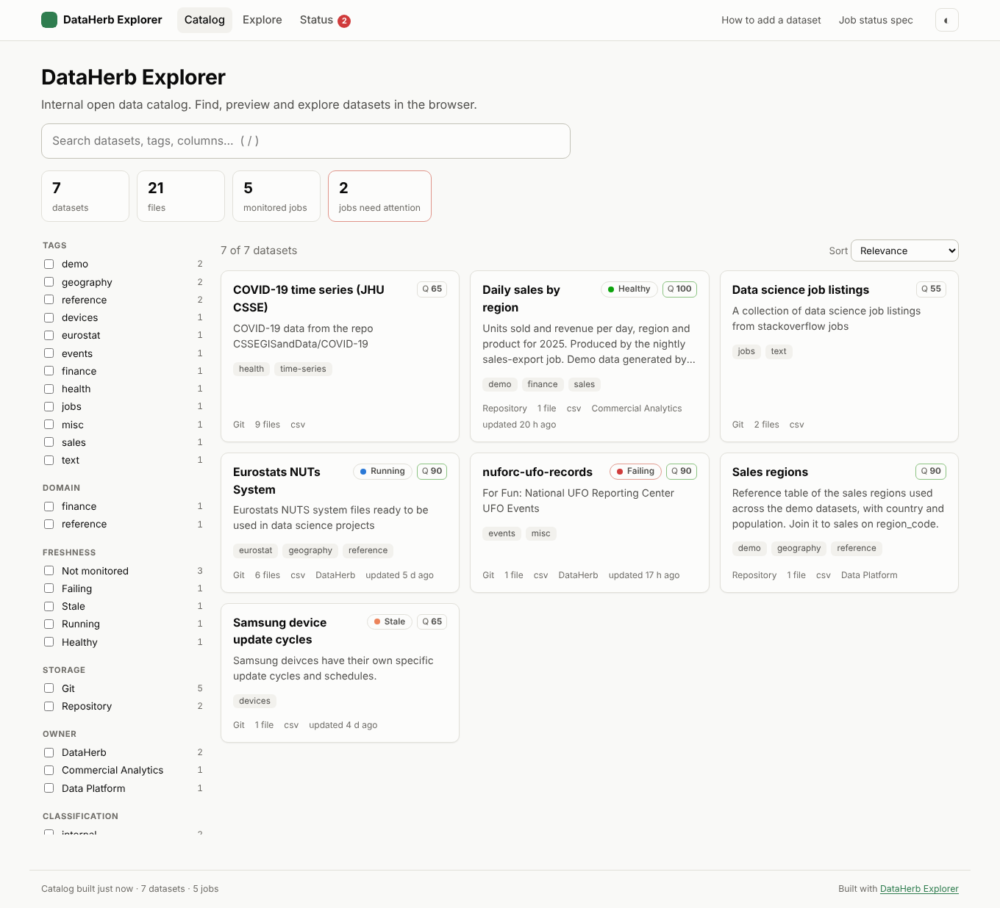
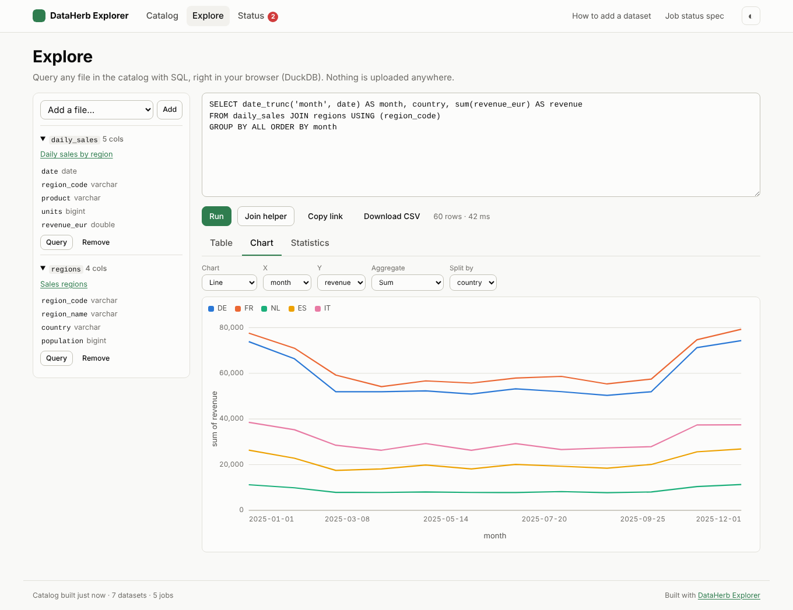
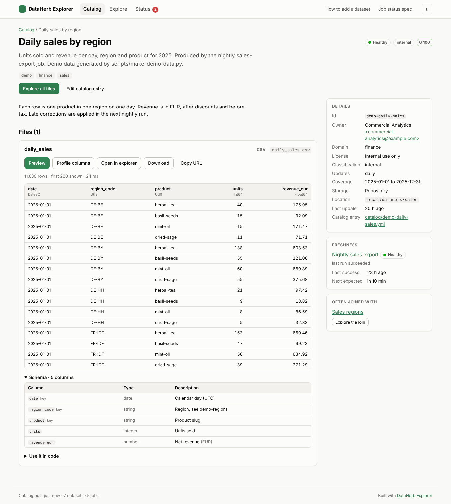
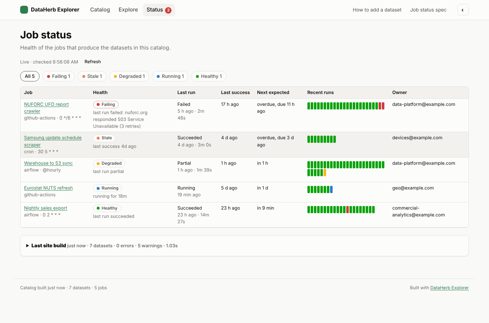

# DataHerb Explorer

A data catalog and explorer for your organization's open data that is just a
static website. Fork it, point one YAML file at your git repositories and S3
buckets, and get:

- **A searchable catalog** with facets (tags, domain, owner, freshness, storage, format), schemas, documentation and copy-paste snippets.
- **Job status monitoring**: every pipeline (Airflow, GitHub Actions, cron) writes a small JSON status file; the site shows what is failing, stuck or stale, live, without a backend. See the [status file spec](docs/job-status-spec.md).
- **In-browser exploration** with DuckDB-WASM: preview and profile any CSV, Parquet or JSON file, write SQL across datasets, build joins with a helper, draw bar, line, scatter and histogram charts, and get summary statistics and correlations. Shareable links capture the query.
- **Catalog tooling**: `dataherb create` drafts metadata from data files, `dataherb catalog validate` checks entries in CI, `dataherb catalog lint` scores metadata quality, `dataherb status check` alerts on unhealthy jobs.

No server, no database. A scheduled GitHub Actions job rebuilds the site; data
is served straight from S3, git or the site itself. This is v2 of
[DataHerb](https://dataherb.github.io).

| Catalog | Explore |
|---|---|
|  |  |
| **Dataset** | **Job status** |
|  |  |

## Quick start

```bash
git clone https://github.com/DataHerb/dataherb-explorer && cd dataherb-explorer
pip install -r requirements.txt   # the dataherb CLI
dataherb catalog build        # reads dataherb.config.yml + catalog/, writes dist/
dataherb catalog serve        # http://127.0.0.1:8000
```

The demo catalog mixes datasets in this repo (`demo/`), datasets in other
DataHerb git repos, and simulated job status files.

## Make it yours

1. **Fork** (or use as a template) and enable GitHub Pages with source "GitHub Actions".
2. **Edit `dataherb.config.yml`**: title, accent colour, links, and your stores
   (git hosts, S3 buckets). See [docs/config.md](docs/config.md).
3. **Replace `catalog/`** with one small YAML file per dataset, or turn on
   `catalog.discover` to pick up every `dataherb.yml` under an S3 prefix.
   See [docs/adding-datasets.md](docs/adding-datasets.md).
4. **Point `status.sources`** at where your jobs write status files, and add
   the emitter to your jobs ([Airflow](examples/airflow/dataherb_status.py),
   [GitHub Actions](examples/github-actions/crawler.yml), [shell](examples/shell/emit-status.sh)).
5. **Delete `demo/`** and `scripts/make_demo_*.py`.
6. If your data is in S3, set up browser access and CORS: [docs/s3.md](docs/s3.md).
   If browsers can't reach public CDNs, set `explorer.duckdb.mode: vendored`.

The site rebuilds on every push to `main`, every hour, and whenever a pipeline
sends a `dataset-updated` event. To host on S3/CloudFront instead of Pages,
set `DEPLOY_TARGET=s3` (see [deploy-s3.yml](.github/workflows/deploy-s3.yml)).

## Repository layout

```
dataherb.config.yml     the one config file
catalog/                one YAML entry per dataset
demo/                   demo datasets and status files (delete in a fork)
site/                   the static site (vanilla JS, no build step)
.github/workflows/      CI, Pages and S3 deploys
.github/actions/emit-status/   GitHub Action that writes status files
examples/               status emitters for Airflow, Actions, shell
docs/                   config, adding datasets, status spec, S3, architecture
```

## CLI

The builder is the `dataherb` CLI from [dataherb-python](https://github.com/DataHerb/dataherb-python); the JSON Schemas live in its `dataherb/catalog/schemas/`.

| Command | |
|---|---|
| `dataherb catalog build [-o dist] [--strict]` | Build the site. `--strict` fails on unreachable datasets. |
| `dataherb catalog validate` | Validate the config and catalog entries against the schemas. |
| `dataherb catalog lint [--min-score N]` | Metadata quality report per dataset. |
| `dataherb create [folder] --format yaml` | Draft `dataherb.yml` from the data files in a folder. |
| `dataherb status emit --target s3://... --job-id X --status running/success/failed ...` | Write a job status file. |
| `dataherb status check` | Print job health; exit 1 if any job is failing, stuck or stale. |
| `dataherb catalog serve [dist]` | Serve a built site locally. |

## Development

```bash
pip install -r requirements.txt
npm ci && npm run vendor     # optional: self-host DuckDB-WASM in site/vendor
```

How the pieces fit: [docs/architecture.md](docs/architecture.md).

## License

MIT
